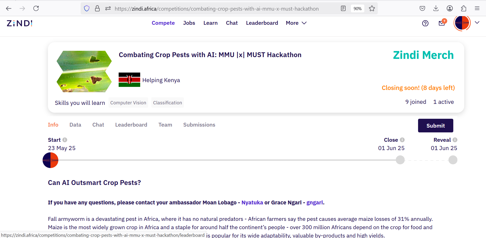

# Combating Crop Pests with AI: MMU |x| MUST Hackathon

## Overview

This repository contains the baseline notebook and Second place solution for the **Combating Crop Pests with AI** hackathon hosted on [Zindi](https://zindi.africa/). The challenge focuses on early detection of fall armyworm infestations in maize crops using AI-powered image classification.

---

## Challenge Background

Fall armyworm is a devastating pest threatening maize crops across Africa. With no natural predators on the continent, this pest causes significant yield losses, estimated at an average of **31% annually** for maize farmers. Maize is a vital staple food for over 300 million Africans and a key source of food and nutritional security, especially for smallholder farmers.

The widespread impact of fall armyworm contributes to food insecurity and poverty, particularly in vulnerable rural communities. There is an urgent need for early intervention technologies that can help farmers detect infestations promptly and reduce crop losses.

---

## Objective

Develop a binary image classification model to detect whether a maize plant is affected by the fall armyworm. The model will be deployed as part of a **mobile edge application** aimed at empowering smallholder farmers in Uganda and across Africa to conduct field-based diagnosis and take early action.

---

## Notebook

**Notebook Name:** `Combating_Crop_Pests_with_AI_Baseline.ipynb`

The notebook includes:

* Data preprocessing and augmentation
* Dataset organization for training and validation
* Model architecture and training pipeline
* Inference on test images and prediction export

---

---

## 2nd_placeSolution
A folder contining second place solution:

`2NDplace_Using _ACCmetric`; Notebook using Accuracy Metric 
`AUC_2NDplace.html`; Illustration of second place solution using AUC Metric 

---

## Usage

* Clone this repo and run the notebook in an environment with the necessary dependencies (PyTorch, torchvision, torch-lr-finder, etc.).
* Follow the notebook to preprocess images, train the model, and generate predictions.
* Adjust parameters and augmentations as needed to improve performance.

---

## Resources

* [Zindi Competition Page](https://zindi.africa/competitions/combating-crop-pests-with-ai-mmu-x-must-hackathon)
* Dataset containing labeled maize leaf images (affected vs. unaffected by fall armyworm).

---

## Acknowledgments

This work is part of the **Combating Crop Pests with AI: MMU |x| MUST Hackathon**, aiming to support smallholder farmers in Africa by leveraging AI to combat crop pests and improve food security.
